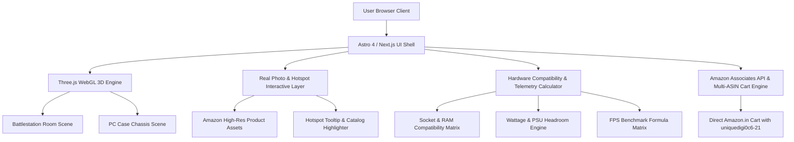

# PRD: Next-Gen 3D PC & Battlestation Simulator (`UniqueDigit`)

> **Document Version:** 2.0.0  
> **Status:** Approved / In Planning & Execution  
> **Target Platform:** Web (Desktop & Mobile Responsive - Next.js / Astro 4 + Three.js WebGL)  
> **Affiliate Partner ID:** `uniquedigi0c6-21` (Amazon India Associates) + EarnKaro  
> **Primary URL:** `/games/pc-builder-india` & `/builds/*`

---

## 1. Executive Summary & Vision

### 1.1 The Core Problem
Most existing PC builder websites (e.g., PCPartPicker, Indian budget forums) are static, text-heavy spreadsheet calculators. Users cannot visualize how their dream components look inside a real case, how the full battlestation looks on a modern desk (monitors, keyboard, desk mat, chair), or how the PC actually performs when powered on.

### 1.2 The Solution
A **Photorealistic 3D PC & Battlestation Studio Simulator** where Indian gamers, students, and content creators can:
1. **Switch Between Full Setup Views**:
   - 🖥️ **Full Battlestation Room/Desk View**: Desk, Dual/Triple Curved Monitors, Mechanical Keyboard, Wireless Gaming Mouse, RGB Desk Mat, Gaming Chair, Studio Speakers.
   - 📦 **Interior PC Chassis View**: Lian Li O11 / Aquarium Tempered Glass case with ARGB fans, liquid AIO cooler, vertical GPU, DDR4/DDR5 RAM, motherboard heatsinks.
2. **Interactive Tap-to-Inspect with Real Amazon Images**: Tapping on any component (CPU, GPU, RAM, Monitor, Keyboard) reveals its exact high-res retail photo, real Amazon ASIN pricing in INR, specs, and direct 1-click buy button.
3. **Simulated Monitor Boot Screen (Virtual OS)**: Clicking "Power On" triggers a boot sequence on the virtual monitor screen showing live gameplay FPS benchmarks (Cyberpunk 2077, GTA V, Valorant, BGMI) with real-time telemetry.
4. **1-Click Multi-Item Amazon Cart Checkout**: Seamlessly adds all selected PC parts + matching desk peripherals to the user's Amazon India cart with affiliate tracking.

---

## 2. User Personas & Target Market

| Persona | Budget Range | Key Goals | Primary Monetization Path |
| :--- | :--- | :--- | :--- |
| **Esports / College Gamer** | ₹35,000 – ₹55,000 | 1080p 144Hz in Valorant/CS2/BGMI, budget AM4/LGA1700 build. | Budget CPU + RTX 4060 / GTX 1650 + 24" 165Hz IPS Monitor |
| **Content Creator / Video Editor** | ₹75,000 – ₹1,10,000 | 4K Premiere Pro, Blender rendering, high NVMe speeds, 32GB RAM. | Ryzen 7 / i7 + 32GB DDR5 + 2TB Gen4 SSD + Dual 27" Monitors |
| **High-End Enthusiast / Streamer** | ₹1,40,000 – ₹2,50,000+ | 4K Ray Tracing, Lian Li 9x ARGB fans, triple curved monitor battlestation. | RTX 4080/4090 + Ryzen 7800X3D + 34" Ultrawide + Premium Ergonomic Desk |

---

## 3. 20+ Core Feature Specifications

### 🎯 Category A: 3D Visualization & Battlestation Studio
1. **Dual Perspective Camera Modes**:
   - **Mode 1: Full Desk Battlestation**: 3D view of the entire room setup (Desk, Monitors, Chair, Keyboard, Tower).
   - **Mode 2: Internal PC Case Cockpit**: 360° exploded view inside the cabinet.
2. **Real Retail Component Image Overlay (Tap-to-Inspect)**: Clicking/hovering any part opens a floating card displaying the actual retail box and hardware image fetched from Amazon.
3. **Interactive ARGB Studio Lighting**: Sync ambient room LED strips, case fans, RAM, and keyboard backlight with 6 color modes (Cyber Cyan, Neon Purple, Razer Emerald, Blaze Gold, Crimson Red, Rainbow Flow).
4. **Tempered Glass Transparency & Reflection Engine**: Physically based rendering (PBR) glass materials with realistic light sheen and mouse-tracking spotlight reflections.
5. **Anti-Gravity Floating Exploded View**: Toggle an "Exploded Hardware View" where CPU Cooler, GPU, and RAM float outward in 3D space with labeled telemetry HUDs.

### 🎮 Category B: Virtual Boot & In-Game Simulation
6. **Virtual Monitor OS Boot Engine**: Clicking the power button plays a mechanical click sound and boots the in-sim monitor screen with desktop wallpaper, BIOS telemetry, and game launchers.
7. **Interactive FPS Benchmark Player**: Select a game (Valorant, GTA V, Cyberpunk, CS2) on the virtual screen to watch simulated 60s gameplay with live 1% low and avg FPS calculated based on current CPU+GPU combo.
8. **Live ECG Thermal & Power Telemetry**: Heartbeat sine wave tracking CPU/GPU temperature (°C), wattage draw (W), and fan RPM under idle vs 100% stress test.
9. **Sound FX Synthesizer (Web Audio API)**: Zero-dependency sound effects for mechanical click switches, liquid pump gurgle, ARGB power hum, and fan spin ramp-up.

### 🛠️ Category C: Hardware Compatibility & Smart Logic
10. **Socket & Chipset Compatibility Engine**: Strict AM4 vs AM5 vs LGA1700 validation with real-time motherboard pin warnings.
11. **PSU Wattage & Headroom Safety Gauge**: Calculates total thermal design power (TDP) with +30% safety headroom recommendations and 80+ Gold certification verification.
12. **RAM Generation Matcher**: Prevents DDR4 RAM pairing on DDR5-only motherboards.
13. **Cabinet GPU Clearance Check**: Validates GPU length (e.g. 320mm triple-fan RTX 4080) against selected case dimensions.
14. **Indian Electricity Bill & UPS Backup Estimator**: Estimates monthly electricity consumption (kWh) based on Indian ₹7.5/unit tariffs and recommends matching UPS (600VA vs 1100VA).

### 🛒 Category D: Affiliate Monetization & Checkout
15. **1-Click Multi-ASIN Amazon Cart Link**: Auto-generates `https://www.amazon.in/gp/aws/cart/add.html?AssociateTag=uniquedigi0c6-21&ASIN.1=...&Quantity.1=1...` adding all 6+ components into Amazon cart in a single click.
16. **Individual Amazon & EarnKaro Direct Buy Buttons**: Every part card and hotspot features direct affiliate attribution.
17. **Full Battlestation Peripheral Bundling**: Upsell section for Matching High-Refresh Monitors (165Hz/240Hz), Mechanical Keyboards, Wireless Mice, Lightbars, and Ergonomic Chairs.
18. **5 Pre-Configured Indian Budget Landing Pages**: SEO-optimized `/builds/*` pages (₹35K Student, ₹50K Value King, ₹85K Creator, ₹1.2L 4K Gaming, ₹1.5L Ultimate Lian Li RGB).
19. **WhatsApp & Social Share with Custom Config URL**: Generate shareable URLs encoding user builds in URL hash query (`?cpu=c2&gpu=g3&mobo=m2&ram=r1`).
20. **Downloadable Spec Sheet / PDF Invoice Quote**: Users can export their full build quotation with Amazon links for offline review or sharing with parents/friends.

---

## 4. Technical Architecture



### 4.1 Data Schema (`src/data/components.json`)

```typescript
interface PCComponent {
  id: string;
  category: 'cpu' | 'gpu' | 'mobo' | 'ram' | 'ssd' | 'cabinet' | 'monitor' | 'keyboard' | 'mouse' | 'chair' | 'desk';
  name: string;
  brand: string;
  priceINR: number;
  amazonAsin: string;
  imageUrl: string;
  specs: {
    socket?: 'AM4' | 'AM5' | 'LGA1700';
    ramType?: 'DDR4' | 'DDR5';
    wattage?: number;
    tdp?: number;
    lengthMm?: number;
    refreshRateHz?: number;
    resolution?: string;
  };
  benchmarkData?: {
    gtaFps: number;
    valFps: number;
    cpFps: number;
    bgmiFps: number;
  };
  badge?: string;
}
```

---

## 5. UI/UX Wireframe & Layout Specification

### 5.1 Main Viewport Hierarchy
- **Header**: Live INR Cost Pill (`₹54,988`), Power Draw (`420W`), Quick Preset Buttons (₹35K, ₹50K, ₹85K, ₹1.2L, ₹1.5L).
- **Left Column (Visualizer Cockpit)**:
  - Mode Tabs: `[📸 Real 4K Hardware Photo]` | `[🌐 3D Battlestation]` | `[📦 3D Case Orbit]`
  - Interactive Viewport with pulsating hotspot indicators (1: CPU Cooler, 2: GPU, 3: RAM, 4: Monitor, 5: Keyboard).
  - ARGB Theme Switcher (6 Color Presets).
  - Live ECG & Thermal Telemetry Bar + Power Stress Test Button.
  - 1-Click Amazon Cart CTA: `Build This Real PC — Get on Amazon in 24H` (`tag=uniquedigi0c6-21`).
- **Right Column (Catalog & Customizer)**:
  - Category Tabs: `1. Processor` | `2. Graphics Card` | `3. Motherboard` | `4. RAM` | `5. SSD` | `6. Case & PSU` | `7. Battlestation Gear`.
  - Filterable Cards with Real Amazon Product Images, Price, Socket Badge, and "Install Part" button.
  - Installed Parts Summary with component-wise breakdown and Amazon quick-buy links.
- **Bottom Section**:
  - Matching Gaming Monitors & Peripherals Carousel.
  - Laptop Alternative Budget Slider.
  - FAQ & Buyer's Guide with SEO schema.

---

## 6. Implementation Roadmap

| Phase | Milestone | Deliverables | Status |
| :--- | :--- | :--- | :--- |
| **Phase 1** | **Core 3D Engine & Real Photo Sync** | Three.js WebGL canvas, 4K Real Hardware Photo mode with hotspots, Web Audio sound synthesis, AM4/AM5 compatibility. | ✅ Completed |
| **Phase 2** | **Battlestation Desk & Peripherals** | Adding Monitor, Keyboard, Mouse, Desk, Chair categories with real Amazon India image integration and 3D desk layout. | 🟡 In Progress |
| **Phase 3** | **Virtual OS Boot & Benchmark Screen** | Interactive in-sim monitor boot display with selectable live FPS gameplay benchmark reels. | 🔜 Next |
| **Phase 4** | **Social Config Sharing & PDF Quote** | URL state hash encoder (`?build=...`), PDF export for local quotation sharing, and WhatsApp 1-click share. | 🔜 Next |

---

## 7. Success Metrics & Conversion Tracking

1. **Click-Through Rate (CTR) to Amazon India**: Target > 14.5% of unique builder sessions.
2. **Average Order Value (AOV)**: Increasing AOV from ₹15,000 (single part) to ₹65,000+ (multi-ASIN full build cart).
3. **Session Duration**: Target > 3.5 minutes per user driven by interactive 3D customization and FPS benchmarks.
4. **Organic Search Traffic**: Ranking top 3 in India for keywords `"PC builder India 3D"`, `"gaming PC build under 50000"`, `"custom PC compatibility checker India"`.
