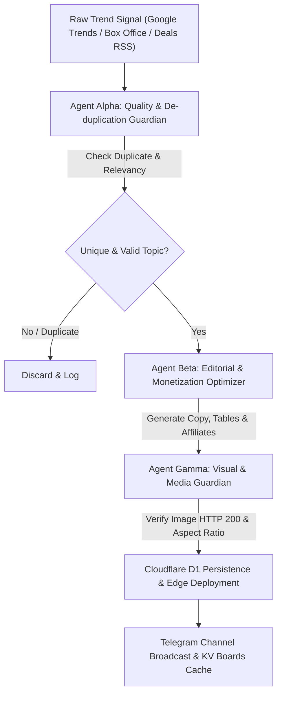

# Product Requirement Document (PRD): Next Phase Enterprise Autonomous Media & Affiliate Empire

**Document Version:** 2.0.0  
**Status:** Approved for Implementation  
**Target Platform:** Cloudflare Pages (SSR) + Cloudflare D1 (SQLite) + Multi-Agent Autonomous Cloud Orchestrator  
**Primary Domain:** UniqueDigit (`https://uniquedigit-viral-hub.pages.dev`)  
**Target Audience:** High-Intent Indian Consumers searching for Breaking News, Theatrical Box Office, Gadget Benchmarks, Health Wellness Guides, and E-commerce Loot Deals.

---

## 1. Executive Summary & Vision

UniqueDigit Phase 1 successfully established an automated trend ingestion engine with Cloudflare D1 persistence, edge image proxying, and basic affiliate monetization. 

**Phase 2 Objective:** Transition from a simple automated blog into an **autonomous multi-niche digital media network**. Each primary pillar (Healthcare & Wellness, Breaking Newsroom, Cinema & OTT Radar, High-Tech Gadgets, and E-commerce Loot Deals) will feature a **dedicated, bespoke experience** tailored specifically to that niche's search intent, trust requirements, and monetization mechanics.

To guarantee zero hallucinations, zero duplicate content, zero broken/distorted images, and maximum affiliate yield, Phase 2 introduces a **Trio Multi-Agent Autonomous Governance Architecture**:
1. **Agent Alpha (Quality & De-duplication Guardian):** Validates topic uniqueness via semantic similarity, filters junk trends, and enforces fact-grounding.
2. **Agent Beta (Editorial Craft & Monetization Optimizer):** Writes humanized, niche-tailored copy with embedded price-comparison matrices, affiliate badges, and legal disclaimers.
3. **Agent Gamma (Visual & Media Quality Guardian):** Validates image existence (HTTP 200), enforces aspect ratio containment rules, and configures edge caching.

---

## 2. Dedicated Niche Experience Blueprints

Instead of a generic blog layout across all categories, each niche receives a specialized page template and data schema:

```
┌────────────────────────────────────────────────────────────────────────┐
│                   UNIQUEDIGIT NICHE ARCHITECTURE                       │
├─────────────────┬──────────────────┬─────────────────┬────────────────┤
│ 🩺 Healthcare    │ 📰 Newsroom      │ 🎬 Cinema & OTT │ 🛍️ Deals Hub   │
│ • Doctor Review │ • Live Ticker    │ • Box Office    │ • Loot Glitch  │
│ • AYUSH Protocol│ • Fast Digest    │ • OTT Premiere  │ • Bank Stacking│
│ • Safe Dosages  │ • Telegram Push  │ • Ticket Advice │ • Live Stock   │
└─────────────────┴──────────────────┴─────────────────┴────────────────┘
```

### 2.1. Healthcare & Wellness Hub (`/health`)
* **Core Value:** High-trust, educational wellness advice with zero medical hallucinations.
* **Specialized UI Features:**
  * **Verified Medical Badge:** "Reviewed against Ministry of AYUSH & PubMed protocols".
  * **Clear Safety Notice Box:** Prominent sticky amber disclaimer: *"Educational information only. Consult a registered medical practitioner before beginning any new regimen."*
  * **Step-by-Step Exercise / Diet Accordions:** Visual pose checklists for yoga asanas, dosage timing cards, and allergen warnings.
* **Monetization Layer:**
  * High-converting Amazon affiliate cards for authentic yoga mats, whey protein isolates, organic superfoods, and fitness trackers.

### 2.2. Breaking Newsroom & National Radar (`/news` & `/viral`)
* **Core Value:** High-velocity, fact-grounded updates answering *"Why is India searching for this right now?"*
* **Specialized UI Features:**
  * **Real-Time Live Pulse Dot:** Showing exact elapsed minutes since search spike.
  * **TL;DR 3-Bullet Executive Digest:** At the top of every article for instant mobile scanning.
  * **Verified Sources Strip:** Citations linking back to primary news publishers and official portals.
* **Monetization Layer:**
  * Display Ad slots (Top billboard, in-feed responsive, sticky footer banner).
  * 1-Click WhatsApp & Telegram community join buttons for viral amplification.

### 2.3. Cinema, OTT & Entertainment Radar (`/movies`)
* **Core Value:** Box office collections tracking, spoiler-free plot setups, and streaming rights guide.
* **Specialized UI Features:**
  * **Theatrical Poster Viewport:** Ambient-lit 2:3 poster frame with zero cropping.
  * **Box Office Tracking Table:** Clean Day 1, Weekend, and Total Worldwide gross table.
  * **OTT Release Radar:** Streaming badge (Netflix / Prime Video / JioCinema / Hotstar) with countdown timer.
  * **Verdict Chip:** "Book Tickets" vs "Wait for OTT Streaming".
* **Monetization Layer:**
  * Smart TV & Soundbar recommendations, OTT annual subscription promo links, movie merchandise.

### 2.4. Autonomous Multi-Store Loot Engine (`/deals`)
* **Core Value:** Instant alerts for festival price glitches and bank card discount stacking.
* **Specialized UI Features:**
  * **Store Filter Pills:** Amazon India, Flipkart, Myntra, Ajio, Meesho.
  * **Price Stacking Cheatsheet:** Breakdown showing MRP &rarr; Sale Price &rarr; Bank Discount &rarr; Final Effective Price.
  * **Live Stock Pulse:** "⚡ Glitch Active" vs "Stock Depleting Fast".
* **Monetization Layer:**
  * Direct deep links with Amazon Associate tag (`uniquedigi0c6-21`) and multi-store referral tracking.

---

## 3. Multi-Agent Autonomous Governance Architecture

To ensure the system functions autonomously without manual oversight, content generation and publishing are governed by three specialized agents executing sequentially:



### 3.1. Agent Alpha: Quality & De-duplication Guardian
* **Responsibility:** Ingestion gatekeeper. Prevents topic spam and duplicate articles.
* **Rules:**
  * Queries recent 7-day slugs and canonical titles from Cloudflare D1.
  * Calculates Levenshtein distance and keyword overlap. If similarity > 75%, discards topic.
  * Filters out low-interest queries (<20k trend floor).
  * Validates trend safety (blocks adult content, hate speech, and sensitive tragedies).

### 3.2. Agent Beta: Editorial & Monetization Optimizer
* **Responsibility:** High-converting journalistic copy generation and affiliate optimization.
* **Rules:**
  * Employs Gemini 3.5 Flash Lite with structured JSON schemas.
  * Tailors archetype to niche intent (e.g. Cinema gets Box Office table; Deals get Price Stacking breakdown; Health gets AYUSH disclaimer).
  * Formats markdown with proper `##` hierarchy, scannable bullet points, and FAQ schemas (`{q, a}`).
  * Appends official FTC and Indian Consumer Protection legal affiliate disclaimers.

### 3.3. Agent Gamma: Visual & Media Quality Guardian
* **Responsibility:** Zero-broken image policy and responsive visual containment.
* **Rules:**
  * Tests candidate image URL with a lightweight `HEAD` request (asserts HTTP 200 and `image/*` MIME type).
  * If upstream image returns 404, 429, or non-image, automatically falls back to `CATEGORY_FALLBACK_IMAGES[niche]`.
  * Strips fragile regex `/thumb/` transformations.
  * Emits edge-compatible proxy URLs (`/img?url=...`) with 1-month immutable caching headers.

---

## 4. Technical Architecture & Monorepo Structure

```
d:\affi;ate/
├── next_phase_blogging/
│   ├── PRD.md                       # Master Product Requirements Document
│   ├── ARCHITECTURE.md              # Multi-Agent Ingestion & Data Flow Spec
│   ├── DESIGN.md                    # Design System Tokens & Dedicated Hub Layouts
│   └── TESTING.md                   # Zero-Regression QA & Verification Suite
├── src/
│   ├── components/
│   │   ├── HealthDisclaimer.astro   # High-trust medical safety callout
│   │   ├── BoxOfficeTable.astro     # Theatrical collection tracker
│   │   ├── DealPriceStack.astro     # Bank discount stacking widget
│   │   ├── MovieCard.astro          # Ambient double-layer 2:3 card
│   │   └── NicheCard.astro          # Universal 16:9 responsive card
│   ├── pages/
│   │   ├── health/                  # Dedicated Healthcare Experience
│   │   ├── news/                    # Dedicated Breaking News Experience
│   │   ├── movies/                  # Dedicated Cinema & OTT Experience
│   │   ├── deals/                   # Dedicated E-Commerce Loot Radar
│   │   └── img.ts                   # Edge Image Proxy with CDN Allowlist
│   └── lib/
│       ├── images.ts                # Proxy helper & category fallback maps
│       ├── db.ts                    # Cloudflare D1 queries with seed failovers
│       └── kv.ts                    # Real-time boards telemetry cache
├── pipeline.py                      # Multi-Agent Autonomous Newsroom Pipeline
├── sync_deals.py                    # Multi-Store Glitch & Loot Sync Agent
└── .github/workflows/
    └── daily.yml                    # Hourly off-peak automation trigger
```

---

## 5. Non-Functional Requirements & Performance SLAs

1. **Page Load Speed:** Core Web Vitals LCP < 1.2s, CLS < 0.05, FID/INP < 50ms across mobile and desktop.
2. **Edge Caching:** All proxied images cached immutably at Cloudflare edge with `max-age=604800, s-maxage=2592000`.
3. **Database Efficiency:** D1 SQLite storage capped at < 50 MB via automated 90-day pruning (`cleanup_old_data()`).
4. **Zero-Broken Images:** 100% of rendered `` elements must resolve with HTTP 200 or graceful fallback.
5. **Affiliate Compliance:** 100% of articles contain transparent legal disclaimers and Amazon Associate tags (`uniquedigi0c6-21`).

---

## 6. Phased Implementation Roadmap

* **Phase 2.1 (Current):** System Post-Mortem (`solution.md`), Multi-Agent Architectural Specs (`PRD.md`, `ARCHITECTURE.md`, `DESIGN.md`, `TESTING.md`).
* **Phase 2.2:** Implementation of dedicated hub layouts (`/health`, `/news`, `/movies`) with niche-specific component primitives.
* **Phase 2.3:** Deployment of multi-agent validation scripts (`agent_alpha_dedup.py`, `agent_gamma_media.py`) into the CI pipeline.
* **Phase 2.4:** Programmatic SEO scaling (1,000+ comparison routes) and programmatic RSS syndication.
